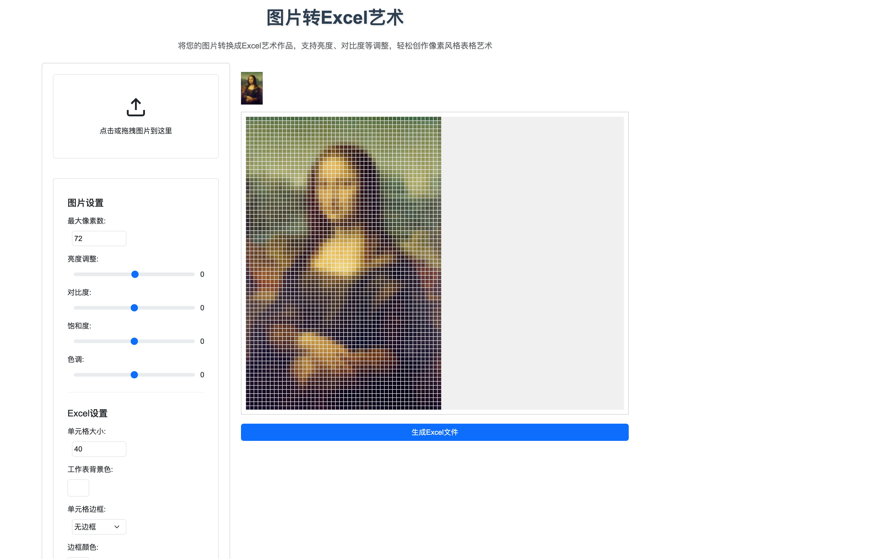
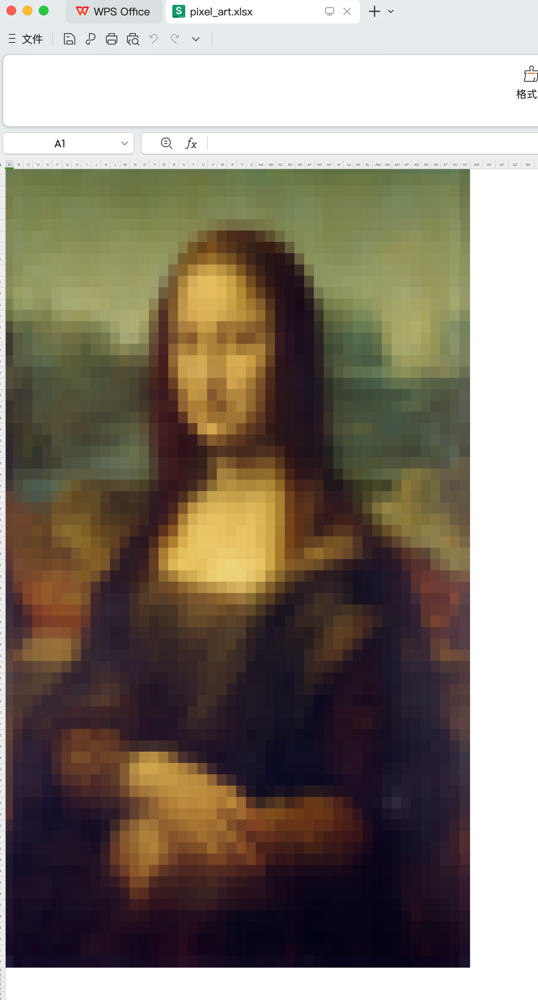

# 图片转 Excel 艺术：轻松创建像素风格表格艺术

在线体验地址：[https://img2excel.cdtools.click](https://img2excel.cdtools.click)

> 一款免费的在线工具，可以将任意图片转换成 Excel 像素艺术作品，支持多种图片调整参数，让你轻松创作独特的表格艺术。

## 功能特色

### 1. 简单易用的操作界面

- 清晰的拖拽上传区域
- 实时预览功能
- 直观的参数调整面板

### 2. 强大的图片调整功能

- **亮度调整**：-100 到 100 的范围调节，让图片更明亮或更暗淡
- **对比度**：-100 到 100 的范围调节，增强或减弱图片的层次感
- **饱和度**：-100 到 100 的范围调节，调整色彩的鲜艳程度
- **色调**：-180 到 180 度的范围调节，改变图片的整体色相

### 3. 灵活的 Excel 输出设置

- **像素密度控制**：最大像素数可在 10-200 之间自由设置
- **单元格样式定制**：
  - 自定义单元格大小
  - 多种边框样式选择
  - 边框颜色自定义
  - 工作表背景色设置
  - Excel 打开时的缩放比例调整

## 使用指南

### 第一步：上传图片

1. 打开工具网页
2. 点击上传区域或直接拖拽图片到指定区域
3. 图片上传后会立即显示预览效果

### 第二步：调整参数

1. **图片效果调整**

   - 使用滑块调整亮度使图片更通透
   - 适当增加对比度提升层次感
   - 调整饱和度改变色彩表现
   - 用色调创造特殊的艺术效果

2. **Excel 输出设置**
   - 设定合适的像素数（建议 50-100 之间）
   - 选择你喜欢的边框样式
   - 调整单元格大小获得最佳显示效果

### 第三步：生成作品

1. 点击"生成 Excel 文件"按钮
2. 等待文件生成（大图可能需要较长时间）
3. 文件会自动下载到你的电脑

## 使用技巧

1. **选择合适的图片**

   - 建议使用对比度较强的图片
   - 简单的图案或标志效果更好
   - 避免细节过多的复杂图片

2. **参数调整建议**

   - 先调整最大像素数确定整体大小
   - 对比度建议适当提高
   - 可以用色调创造特殊的艺术效果

3. **Excel 文件处理**
   - 生成的文件可以用 Excel 直接打开
   - 可以进一步在 Excel 中修改调整
   - 建议将文件另存为较新版本的 Excel 格式

## 注意事项

- 像素数越大，生成时间越长，文件也越大
- 建议从小像素数开始尝试，找到最适合的设置
- 某些特殊的边框样式在旧版 Excel 中可能显示异常

---

有了这个工具，你可以轻松将喜欢的图片转换成独特的 Excel 艺术作品。无论是制作个性化的表格，还是创作像素风格的艺术品，它都能帮你实现。快来试试吧！
